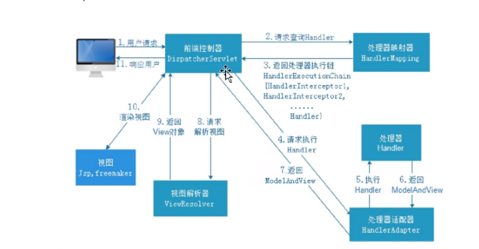

# springmvc学习
## 配置文件
配置文件可以配在servlet中，也可以通过listener配置
### servlet配置
    <servlet>
      <servlet-name>DispatcherServlet</servlet-name>
      <servlet-class>org.springframework.web.servlet.DispatcherServlet</servlet-class>
        <init-param>
            <param-name>contextConfigLocation</param-name>
            <param-value>classpath:springmvc.xml</param-value>
        </init-param>
      <load-on-startup>1</load-on-startup>
    </servlet>
### listener配置
    <listener>
      <listener-class>org.springframework.web.context.ContextLoaderListener</listener-class>
    </listener>
      <context-param>
          <param-name>contextConfigLocation</param-name>
          <param-value>classpath:springmvc.xml</param-value>
      </context-param>
## springmvc流程

## 配置驱动的处理器(HandlerMapping)和适配器(HandlerAdapter)
启用新的处理器和适配器
### 启用方式一
    <mvc:annotation-driven></mvc:annotation-driven>
### 启用方式二
     <bean class="org.springframework.web.servlet.mvc.method.annotation.RequestMappingHandlerMapping"/>
     <bean class="org.springframework.web.servlet.mvc.method.annotation.RequestMappingHandlerAdapter"/>
## 配置视图解析器
     <bean class="org.springframework.web.servlet.view.InternalResourceViewResolver">
         <property name="suffix" value=".jsp"/>
         <property name="prefix" value="/WEB-INF/jsp/"/>
     </bean>
 配置后  
 ``ModelAndView modelAndView = new ModelAndView("/WEB-INF/jsp/test.jsp");``
 可以改成  
  ``ModelAndView modelAndView = new ModelAndView("test");``
 
